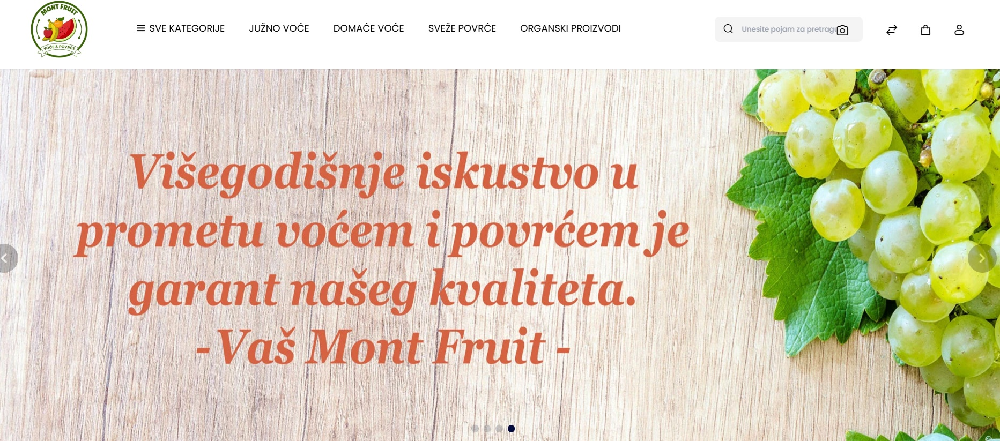

# Monte Fruit

  

**Laravel e-commerce platforma za prodaju voća, povrća i prirodnih proizvoda, bazirana na Bagisto frameworku.**

## ✨ Funkcionalnosti
- ✔️ Pregled i filtriranje proizvoda
- ✔️ CMS stranice (O nama, Politike)
- ✔️ Multijezična podrška (sr, en, hr)
- ✔️ SEO podešavanja
- ✔️ Podrška za .webp slike
- ✔️ Pripremljeno za proširenje u Multivendor sistem (Marketplace)

## 📦 Zahtevi
- PHP 8.1+
- Laravel 11
- MySQL 5.7 / 8+
- Node.js & NPM
- XAMPP ili Cloud hosting (npr. Cloudways)

## 🚀 Instalacija

git clone https://github.com/RadojeBozic/monte-fruit_template.git
cd monte-fruit_template
composer install
cp .env.example .env
php artisan key:generate
php artisan migrate --seed
php artisan storage:link
npm install && npm run dev
🛠 Tehnologije
Laravel 11 (PHP 8.3+)

Bagisto 2.3

Vue.js (admin interfejs)

Tailwind CSS (frontend stilovi)

MySQL

🌍 URL

http://localhost:8082/monte-fruit_template/public/
📂 Struktura projekta
resources/lang/vendor/shop/sr/app.php – srpski prevodi za frontend

resources/lang/vendor/admin/sr/app.php – srpski prevodi za admin

packages/Webkul/... – Bagisto moduli i ekstenzije

public/ – ulazna tačka za aplikaciju

🧾 Licenca
Bagisto je open-source i dostupan pod MIT licencom.

© 2025 Monte Fruit. Sva prava zadržana.
Zasnovano na Bagisto platformi (MIT).
👤 Autor
Radoje Božić – Full Stack Developer
📧 radojebozic1966@gmail.com
GitHub: @RadojeBozic